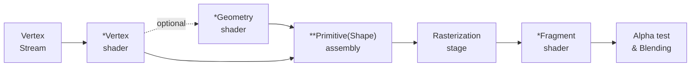

# Shader basics

- \*표시된 단계들은 user configurable
- \*\* 여기서 Primitive란 이용 가능한 가장 작은 처리 단위(각 정점의 해석 결과?)를
  뜻함

## Vertex shader

한 정점의 3D 좌표를 다른 3D 좌표로 변환
변환된 정점 출력

## Geometry shader

선택적인 단계로, Vertex shader의 정점(점)이나 정점 모음(삼각형 등)을 받아 다른 정점 모음으로 변환할 수 있음

원래의 정점을 없애거나 새로운 정점을 추가할 수도 있음

## Primitive(shape) assembly

모든 정점/정점 모음을 받아 주어진 모양의 primitive들로 조립함

## Rasterization stage

조립된 primitive들을 화면에 표시될 픽셀들로 매핑하고 매핑된 각 픽셀에 해당하는 fragment를 출력함

이 때 보이지 않게 되는 픽셀들을 제거하는 clipping을 수행함

## Fragment Shader

생성된 fragment의 색상을 결정하는 단계임

일반적으로 색상 결정에 필요한 3D데이터를 가짐(빛, 그림자 등)

## Alpha test & Blending

fragment의 depth와 stencil값을 참고해 가려지는 fragment들을 걸러내고, 객체의 alpha값에 따라 색을 혼합함

이 과정에서 fragment shader에 결정한 색상과 최종 출력 색상이 달라질 수 있음
